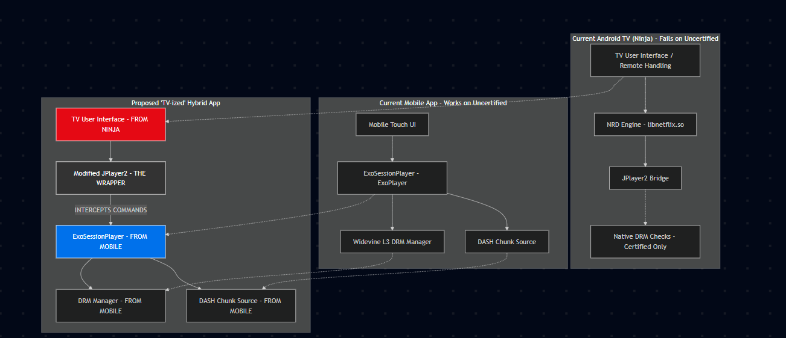

# Netflix-TV-Hotwire 📺⚡

**Porting Netflix Mobile's Streaming Engine to Uncertified Android TV Devices.**

## 🚀 Overview
Netflix-TV-Hotwire is an experimental project focused on "hot-wiring" the high-performance streaming engine from the Netflix Mobile APK to run on uncertified Android TV devices (e.g., Kodak, local brands). 

Standard mobile APKs fail on TV devices because they rely on a complex Hilt/Dagger dependency injection graph that expects a mobile environment. This project bypasses those requirements by surgically intercepting Hilt EntryPoints and manually bootstrapping the playback engine.

## 🛠️ Technical Highlights

### 1. Hilt Bypass Mechanism
We've implemented a manual dependency injection layer (`HybridHiltBypass`) that intercepts Hilt's `EntryPoints.get` calls. This allows the engine to retrieve "mock" services and manually instantiated factories, bypassing the need for a fully initialized Dagger graph.

### 2. JPlayer2 Interception
The project hooks into the TV-native `JPlayer2` pipeline. When the TV app attempts to play a video, we intercept the command and redirect the video surface and playback state to our **HybridPlayerBridge**, which controls the mobile-native `ExoSessionPlayerInternal` engine.

### 3. Multidex Method Limit Resolution
To accommodate the additional hybrid logic and manual dependency copies, the project uses a custom multidex layout. All hybrid bridge and bypass logic is isolated in `classes5.dex` to ensure stability and bypass the 64k method limit.

## 🏗️ Architecture

- **`HybridPlayerBridge`**: The heart of the project. It coordinates between the TV UI and the Mobile Engine.
- **`HybridHiltBypass`**: The "Hacker's DI." Fulfills Hilt requests with manually wired components.
- **`JPlayer2` Patches**: Interception points for Surface management and Playback control.
- **`ExoSessionPlayerInternal`**: The high-quality mobile streaming engine we are bringing to TV.

## 📦 How it was built
1. **Decompilation**: APKTool was used to deconstruct the mobile and TV APKs.
2. **Smali Patching**: Deep-level modification of the engine initialization sequence.
3. **Manual Bootstrapping**: Writing custom Smali classes to synthesize the `PlaylistMap` and `PlaygraphSegment` required by Netflix.

## ⚠️ Disclaimer
This project is for educational and research purposes only. It demonstrates the technical feasibility of engine porting and dependency bypassing in Android environments.

---
**Status**: Phase 6/7 (Manual Ignition Successful)
**Developed by**: abhi963007 & Antigravity AI
